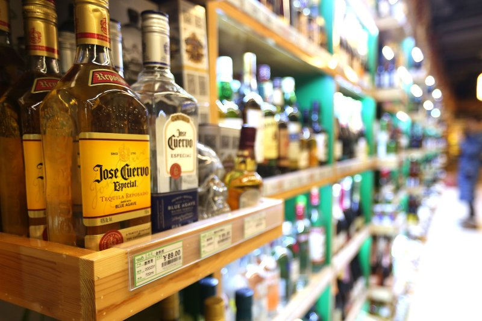
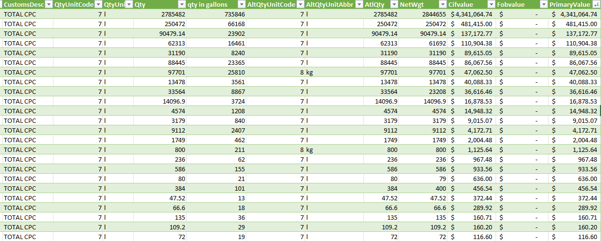
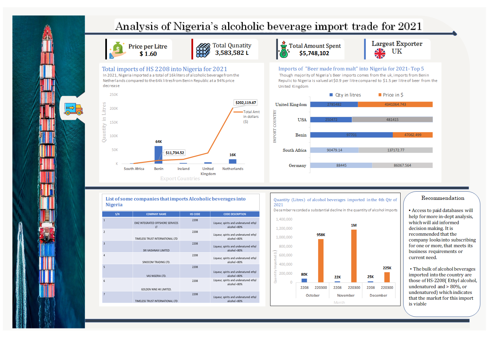
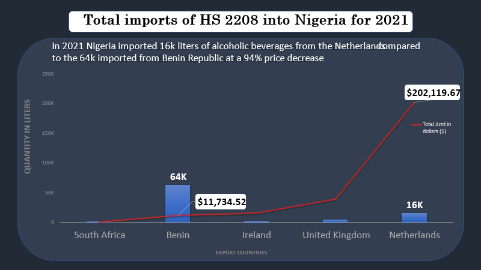
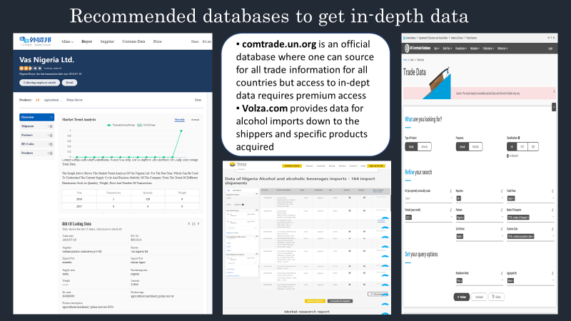

# Alcohol-Import-Analysis

## Analysis of the alcoholic beverage import trades in Nigeria for 2021

---
## Introduction
Alcohol consumption in present-day Nigeria dates back to ancient times, primarily consisting of palm trees and grain-based beverages. With increased trade accessibility, Nigeria now caters to a growing demand for foreign alcoholic brands.
**_This analysis focuses on alcoholic beverage imports in Nigeria in 2021, aiming to extract insights regarding the nature of these imports and the trade routes used by Nigeria._**

## Data Structure
The data for this project was collected from UN Comtrade, which was well-detailed but has restrictions for non-premium subscribers.

As with every international trade rule, the product imports analyzed were;

- HS 2208 — Ethyl alcohol, undenatured; of an alcoholic strength by volume of less than 80% volume; spirits, liqueurs, and other spirituous beverages eg: Whiskey, spirits, etc.
- HS 220300 — Beer made from Malt eg: Heineken e.t.c
## Skills demonstrated 
- Power Query
- Excel functions
- Power Pivot
## Data cleaning and transformation
The use of Power Query and pivot tables has greatly enhanced my data analysis process. While I previously conducted most of my analysis in Excel without utilizing Power Query, I now find it to be a seamless and highly effective approach.

## Analysis and Insights
---
From the analysis carried out, we can infer that they are an enormous amount of alcohol coming into this country. As of the end of 2021, there were 3.5 million liters of alcoholic beverages imported into the country at a total price of $ 5.7 million dollars.

Furthermore, it was observed that there was a substantial decrease in the level of importation in December 2021 compared to the other two months in the 4th Qtr. of the year analyzed. It can also be understood that HS 2208 was the bulk of imports into the country, possibly due to the indigenous production of beer made from malt.

**- Though the majority of Nigeria’s Beer imports come from the UK, imports from the Benin Republic to Nigeria are valued at $0.9 per liter compared to $1.5 per liter of beer from the United Kingdom.**
 

## Limitations
**_Due to restrictions on non-premium users, I could not further analyze this in detail, and as such more analysis would be required._**
---

## Recommendation and Conclusion 
- Access to paid databases will help for more in-depth analysis, which will aid informed decision-making. It is recommended that the company looks into subscribing to one or more, that meets its business requirements or current need.
- The bulk of alcoholic beverages imported into the country are those of HS-2208( Ethyl alcohol, undenatured and > 80%, or undenatured) which indicates that the market for this import is viable
  
**This analysis would require a sequel and I intend to make an analysis of the Soap making industry next.**

_Thank you for reading up on this._

